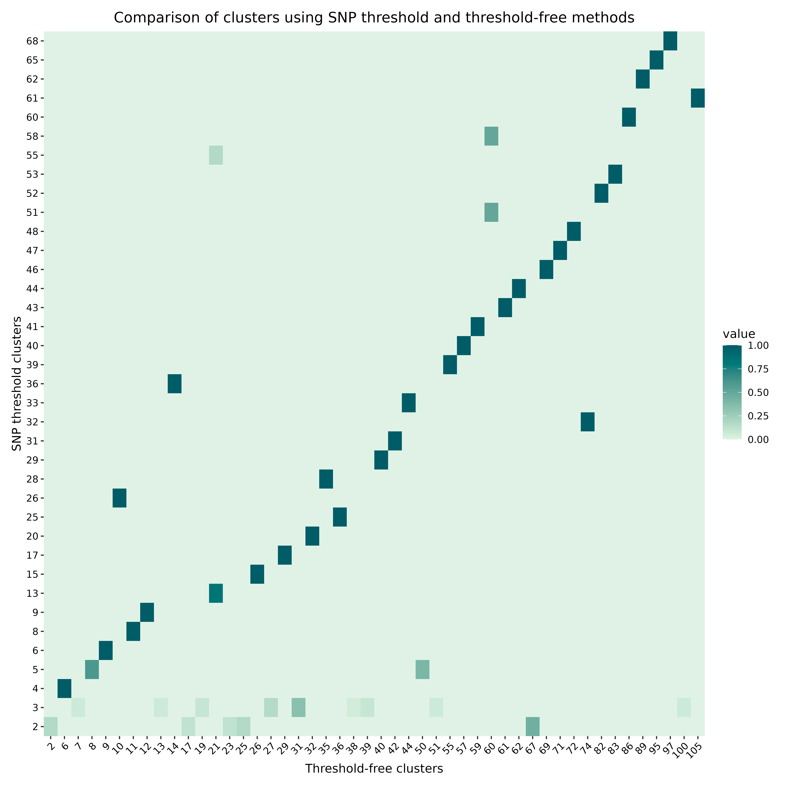
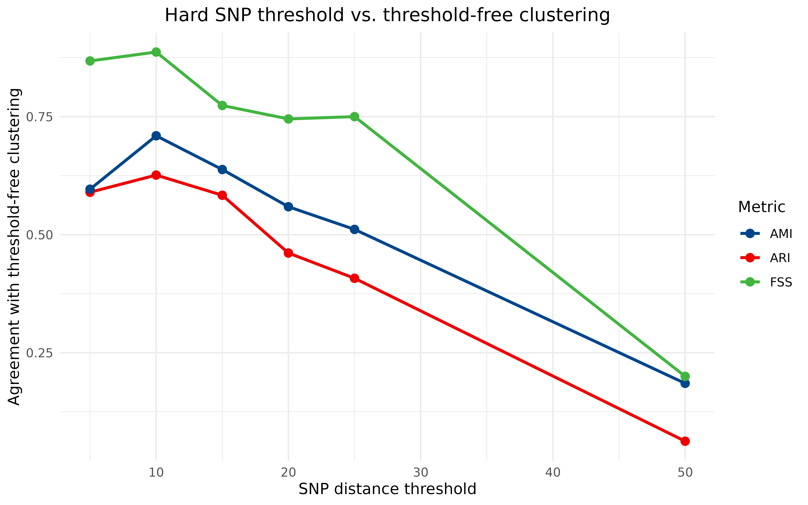

# Comparing cluster assignments

This vignette goes into more detail on comparing different transmission
cluster assignments. Since `hospitraceR` provides different methods for
generating transmission clusters, one of the natural questions is to try
and compare the clusters generated by these different methods. In some
cases, we might want to compare the clusters generated by slightly
different subsets of the data as well. For these purposes, `hospitraceR`
provides a few complementary ways of comparing two cluster assignments:

- a **visual** comparison of the isolates shared between clusters, via
  [`hospitraceRVisualize::plot_jaccard_similarity_heatmap()`](https://theabhirath.github.io/hospitraceRVisualize/reference/plot_jaccard_similarity_heatmap.html);
- two **partition-similarity** statistics that summarise the agreement
  between two clusterings in a single number, the **Adjusted Rand
  Index** (ARI) and the **Adjusted Mutual Information** (AMI), both
  built on top of a contingency table of shared isolates; and
- an **epidemiological** concordance metric, the **fraction of converts
  with the same source** (FSS), which asks whether the two clusterings
  agree on *who infected whom*, not just on how the isolates are
  grouped.

Throughout, we compare the two clusterings produced in the introductory
vignette
[`vignette("hospitraceR")`](https://theabhirath.github.io/hospitraceR/articles/hospitraceR.md):
`clusters_snp`, from the hard 10-SNP threshold method, and
`clusters_sv`, from the threshold-free shared-variant method of Hawken
et al. (2022).

## Visualizing the fraction of shared isolates

One of the simplest ways to compare two cluster assignments is to
visualize the fraction of isolates that are shared between the two
clusters. This can be done using the
[`hospitraceRVisualize::plot_jaccard_similarity_heatmap()`](https://theabhirath.github.io/hospitraceRVisualize/reference/plot_jaccard_similarity_heatmap.html)
function. This function takes in two cluster assignments and returns a
heatmap showing the overlap between the clusters by indicating the
proportion of isolates in each cluster that are also present in the
clusters generated by the other method. Specifically, it calculates the
Jaccard similarity index for each pair of clusters, which is defined as
the size of the intersection of the two clusters divided by the size of
the union of the two clusters. We can calculate the Jaccard similarity
index for each pair of clusters as:

J(A, B) = \frac{\|A \cap B\|}{\|A \cup B\|}

where A and B are the two clusters, \|A \cap B\| is the size of the
intersection of the two clusters, and \|A \cup B\| is the size of the
union of the two clusters. What does this tell us? It tells us the
proportion of isolates in cluster A that are also present in cluster B.
For comparing cluster assignments, we can look at all such pairs of
clusters and visualize the similarity between them.

Before we can use this function, we remove any singleton clusters, which
are clusters that contain only one isolate – these are not very useful
for comparison. We keep the singleton-removed clusters in new variables
so that the full assignments remain available for the metrics computed
later in this vignette:

``` r

# remove singleton clusters from both clustering methods (for plotting only)
clusters_snp_shared <- remove_singleton_clusters(clusters_snp)
clusters_sv_shared <- remove_singleton_clusters(clusters_sv)

# compare the clusters
plot_jaccard_similarity_heatmap(clusters_snp_shared, clusters_sv_shared) +
    # change the color palette
    scale_fill_paletteer_c("grDevices::Mint", direction = -1) +
    # add a title
    ggtitle("Comparison of clusters using SNP threshold and threshold-free methods") +
    # add x and y axis labels
    xlab("Threshold-free clusters") +
    ylab("SNP threshold clusters") +
    # center the title and rotate x axis labels
    theme(
        plot.title = element_text(hjust = 0.5),
        axis.text.x = element_text(angle = 45, hjust = 1)
    )
#> → heatmap built with `geom_tile()`
```



The heatmap is a useful overview, but it does not give us a single
number we can track as we change a clustering parameter or swap in a
different subset of the data. For that, we turn to the contingency table
and the summary statistics built on top of it.

## The contingency table of shared isolates

Both the Jaccard heatmap and the summary statistics below are built from
the same object: a **contingency table** that cross-tabulates the two
cluster assignments. Each cell counts how many isolates fall into a
given cluster under the first assignment *and* a given cluster under the
second.
[`cluster_contingency_table()`](https://theabhirath.github.io/hospitraceR/reference/cluster_contingency_table.md)
computes it directly. Only isolates present in both assignments are
counted; if the two assignments are not over exactly the same set of
isolates, the function warns and restricts itself to the common
isolates.

``` r

cont_table <- cluster_contingency_table(clusters_snp, clusters_sv)
dim(cont_table)
#> [1] 103 110
```

Because the raw assignments place every unclustered isolate in its own
singleton cluster, the full table is large and almost entirely zero,
with most of its mass on a near-diagonal of 1 \times 1 blocks. The
structure is much easier to see if we restrict to the non-singleton
clusters and look at a corner of the table. The diagonal blocks –
clusters of size two and three that both methods recover identically –
are where the two clusterings agree:

``` r

cont_table_shared <- cluster_contingency_table(clusters_snp_shared, clusters_sv_shared)
cont_table_shared[1:8, 1:8]
#>    2 6 7 8 9 10 11 12
#> 2  3 0 0 0 0  0  0  0
#> 3  0 0 0 0 0  0  0  0
#> 5  0 2 0 0 0  0  0  0
#> 6  0 0 3 0 0  0  0  0
#> 7  0 0 0 3 0  0  0  0
#> 8  0 0 0 0 2  0  0  0
#> 10 0 0 0 0 0  0  2  0
#> 11 0 0 0 0 0  0  0  2
```

Reading a table like this directly does not scale: the example data
alone produces a table with over a hundred rows and columns. What we
want is a single number that summarises how well the row partition and
the column partition agree. That is exactly what the Adjusted Rand Index
and Adjusted Mutual Information provide.

## Adjusted Rand Index (ARI)

The **Adjusted Rand Index** measures how often the two clusterings agree
on whether a *pair* of isolates belongs together, corrected for the
agreement we would expect from two random partitions of the same sizes
(Hubert and Arabie, 1985). It ranges from -1 to 1: a value of 1 means
the two clusterings are identical, 0 means they agree no more than
chance, and negative values mean they agree *less* than chance.

There are two entry points.
[`adjusted_rand_index()`](https://theabhirath.github.io/hospitraceR/reference/adjusted_rand_index.md)
takes the two cluster assignments directly and builds the contingency
table for you:

``` r

adjusted_rand_index(clusters_snp, clusters_sv)
#> [1] 0.6262365
```

If you already have a contingency table – for example because you are
computing several metrics from it, or sweeping over a parameter and want
to avoid rebuilding the table each time – you can call
[`ari_from_contingency()`](https://theabhirath.github.io/hospitraceR/reference/ari_from_contingency.md)
on the table instead. The two give the same answer:

``` r

ari_from_contingency(cont_table)
#> [1] 0.6262365
```

## Adjusted Mutual Information (AMI)

The **Adjusted Mutual Information** measures agreement from an
information-theoretic angle: how much knowing an isolate’s cluster under
one assignment tells you about its cluster under the other, again
corrected for chance (Vinh, Epps and Bailey, 2010). It ranges from 0
(the two clusterings are independent) to 1 (they are identical). Where
ARI counts agreement over *pairs* of isolates, AMI is sensitive to how
the isolates are distributed across clusters of different sizes, so the
two metrics need not move together.

As with ARI, there is a convenience wrapper that takes the assignments
directly and a variant that works from a precomputed contingency table:

``` r

adjusted_mutual_information(clusters_snp, clusters_sv)
#> [1] 0.7094371
ami_from_contingency(cont_table)
#> [1] 0.7094371
```

Both ARI and AMI here are well above what we would expect by chance,
confirming the visual impression from the heatmap: the 10-SNP threshold
and the threshold-free method recover broadly similar clusters on this
dataset.

## Epidemiological concordance: fraction of converts with the same source

ARI and AMI are purely structural – they compare partitions without any
knowledge of the underlying epidemiology. But in a transmission study,
the question we actually care about is often not “are the clusters the
same shape?” but “do the two methods agree on *who acquired the organism
from whom?*”. The **fraction of converts with the same source** (FSS)
answers exactly this.

A *convert* is a patient who is inferred to have acquired the organism
during their stay (rather than carrying it on admission), and its
*source* is the index (or weak-index) patient in the same cluster.
`hospitraceR` derives these roles from each clustering via
`[cluster_patient_categorization()]`, using admission status,
surveillance cultures and collection dates.
[`fraction_convert_same_source()`](https://theabhirath.github.io/hospitraceR/reference/fraction_convert_same_source.md)
does this for both clusterings and reports, among patients who are
converts in both, the fraction whose inferred source is the *same
patient* in both. Because it reasons about transmission roles, it needs
more than just the cluster labels – it also needs the
sequence-to-patient map, the admission-positive sequences, the
collection dates, and the surveillance data frame:

``` r

# fraction_convert_same_source() prints diagnostic information about converts
# whose source could not be matched between the two clusterings; we wrap the
# call in capture.output() so the rendered output is just the returned value.
invisible(capture.output(
    fss <- fraction_convert_same_source(
        clusters_snp,
        clusters_sv,
        dna_aln,
        dna_pt_labels,
        adm_seqs,
        dates,
        surv_df,
        converts_without_assigned_source = TRUE
    )
))
fss
#> [1] 0.8867925
```

So even where the two methods carve up the isolates slightly
differently, they agree on the inferred source for a large majority of
converts.

When the two clusterings are built from *different* isolate sets – for
example comparing a clinical-cultures-only clustering against an
all-isolates clustering, where the dates and admission-positive
sequences differ between the two – the convenience wrapper is not
appropriate, because it would categorize both clusterings against a
single set of epidemiological inputs. In that case, build an isolate
lookup for each clustering with
[`get_isolate_lookup()`](https://theabhirath.github.io/hospitraceR/reference/get_isolate_lookup.md)
(passing each its own `seq2pt`, `dates`, and `surv_df`) and pass the two
lookups to
[`fraction_convert_same_source_from_lookups()`](https://theabhirath.github.io/hospitraceR/reference/fraction_convert_same_source_from_lookups.md).
The convenience wrapper used above is simply the special case where both
clusterings share the same epidemiological inputs.

## Putting it together: sweeping across SNP thresholds

The summary statistics come into their own when we want to compare
*many* clusterings at once. The hard-threshold method has a free
parameter – the SNP cutoff – whereas the threshold-free method does not.
A natural question is therefore: *at what SNP threshold does the
hard-cutoff method best reproduce the threshold-free clustering?* We can
answer it by sweeping over a range of thresholds and, at each one,
scoring the resulting clustering against the (fixed) threshold-free
clustering with all three metrics. This is the core of the
`snp_comparisons.R` analysis script, reduced to a single dataset.

At each threshold we build the contingency table once and reuse it for
ARI and AMI, which is why the `*_from_contingency()` entry points are
convenient here:

``` r

thresholds <- c(5, 10, 15, 20, 25, 50)

sweep_df <- do.call(rbind, lapply(thresholds, function(thr) {
    clusters_thr <- get_tn_clusters_snp_thresh(snp_dist, thr)

    # build the contingency table once, reuse for ARI and AMI
    ct <- cluster_contingency_table(clusters_thr, clusters_sv)

    # FSS is chatty about unmatched converts; capture and discard that output
    invisible(capture.output(
        fss <- fraction_convert_same_source(
            clusters_thr,
            clusters_sv,
            dna_aln,
            dna_pt_labels,
            adm_seqs,
            dates,
            surv_df,
            converts_without_assigned_source = TRUE
        )
    ))

    data.frame(
        threshold = thr,
        ARI = ari_from_contingency(ct),
        AMI = ami_from_contingency(ct),
        FSS = fss
    )
}))

sweep_df
#>   threshold        ARI       AMI       FSS
#> 1         5 0.58987526 0.5963013 0.8679245
#> 2        10 0.62623648 0.7094371 0.8867925
#> 3        15 0.58351390 0.6379677 0.7735849
#> 4        20 0.46115498 0.5591713 0.7450980
#> 5        25 0.40765118 0.5112008 0.7500000
#> 6        50 0.06263084 0.1851676 0.2000000
```

To plot all three metrics together, we reshape the results into long
format and draw one line per metric:

``` r

sweep_long <- pivot_longer(
    sweep_df,
    cols = c(ARI, AMI, FSS),
    names_to = "metric",
    values_to = "value"
)

ggplot(sweep_long, aes(x = threshold, y = value, color = metric)) +
    geom_line(linewidth = 1) +
    geom_point(size = 2.5) +
    scale_color_paletteer_d("ggsci::lanonc_lancet") +
    labs(
        x = "SNP distance threshold",
        y = "Agreement with threshold-free clustering",
        color = "Metric",
        title = "Hard SNP threshold vs. threshold-free clustering"
    ) +
    theme_minimal() +
    theme(plot.title = element_text(hjust = 0.5))
```



All three metrics tell a consistent story: agreement with the
threshold-free clustering peaks at a SNP cutoff of around 10, and falls
away steeply at larger thresholds, where the hard-cutoff method lumps
genetically distinct isolates together and the inferred transmission
sources stop matching (FSS drops to zero by a threshold of 50). The
structural metrics (ARI, AMI) and the epidemiological metric (FSS) need
not agree in general – they measure different things – but here they
point to the same well-justified choice of threshold. Running this same
sweep across many sequence types and pooling the results, as
`snp_comparisons.R` does, is how one can choose a defensible threshold
for a hard-cutoff analysis, or argue for dispensing with the threshold
altogether.

## References

Hawken, Shawn E, Rachel D Yelin, Karen Lolans, et al. 2022.
“Threshold-Free Genomic Cluster Detection to Track Transmission Pathways
in Health-Care Settings: A Genomic Epidemiology Analysis.” *The Lancet
Microbe* 3 (9): e652–62.
<https://doi.org/10.1016/s2666-5247(22)00115-x>.
