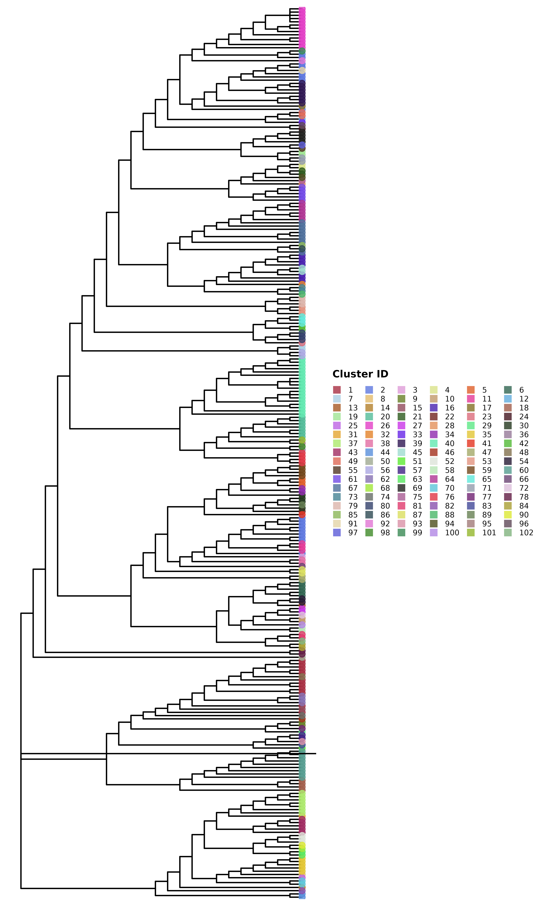
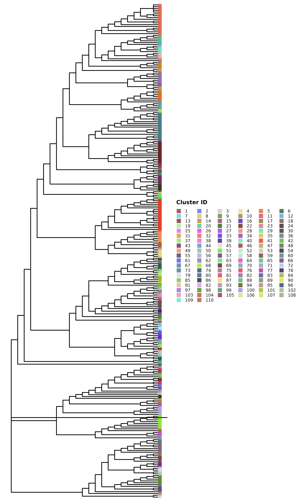
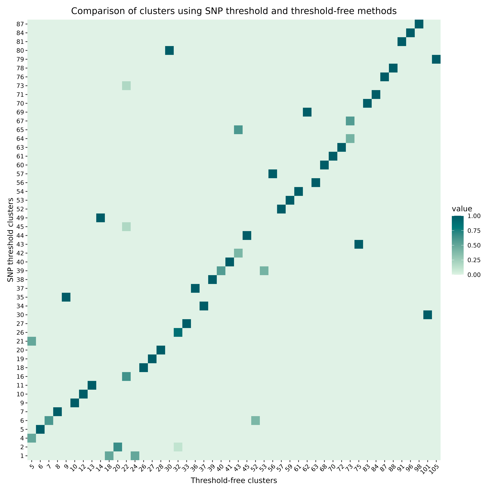
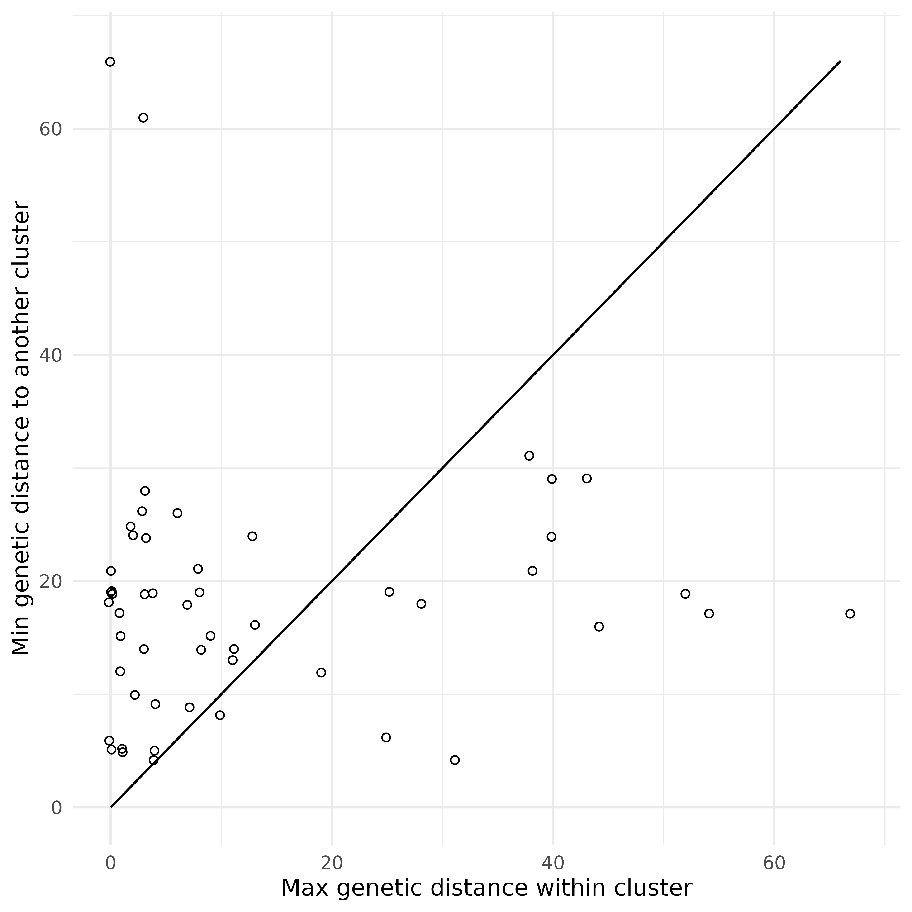
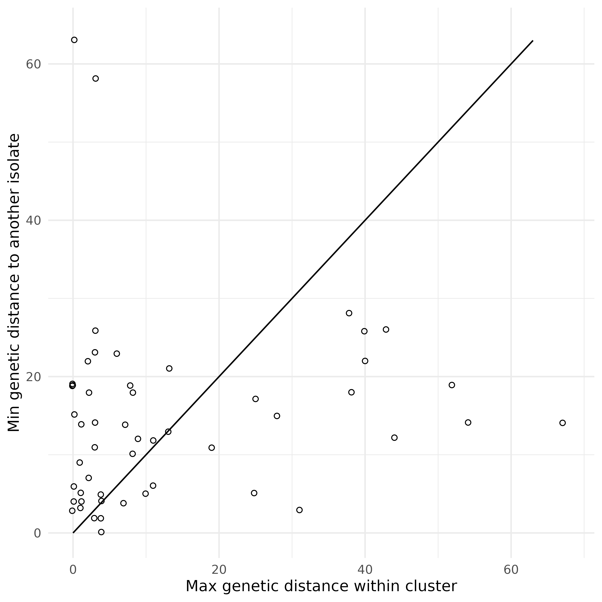

# Introduction to hospitraceR

This vignette provides a brief introduction to the `hospitraceR`
package, which is designed for analysis of transmission clusters using a
combination of whole genome sequencing (WGS) data and epidemiological
information. The package includes functions for clustering,
visualization, and statistical analysis of transmission clusters. To get
started, we will first load the package. Visualization functions are
provided by the companion package
[`hospitraceRVisualize`](https://github.com/theabhirath/hospitraceRVisualize).
We will also load the `ape` package, which is used for phylogenetic
analysis with the package and in the vignette, and `tidyr`, `ggplot2`
and `paletteer` for data manipulation and visualization.

``` r

library(hospitraceR)
library(hospitraceRVisualize)
library(ape)
library(tidyr)
library(ggplot2)
library(ggalign)
#> ========================================
#> ggalign version 1.2.0
#> 
#> If you use it in published research, please cite: 
#> Peng, Y.; Jiang, S.; Song, Y.; et al. ggalign: Bridging the Grammar of Graphics and Biological Multilayered Complexity. Advanced Science. 2025. doi:10.1002/advs.202507799
#> ========================================
library(paletteer)
```

## Loading and preparing data

The `hospitraceR` package comes with a sample dataset that can be used
for demonstration purposes. The dataset contains epidemiological
information for a set of isolates. To load the dataset, we can use the
following command:

``` r

load(system.file("extdata", "example.RData", package = "hospitraceR"))
```

We first read in the sequence file which has been prepared using the
procedure described in Hawken et al. (2022). We can read in the sequence
file using `ape`’s `read.dna` function:

``` r

dna_aln <- read.dna(system.file("extdata", "example.fasta", package = "hospitraceR"), format = "fasta")
```

Now that the sequence file is loaded, we can extract the variable
positions in the alignment. The `var_pos` variable contains a logical
vector indicating which columns in the alignment are variable. The
`dna_pt_labels` variable contains the labels for the sequences in the
alignment, and `facility_trace` is a matrix containing the trace data
for the isolates. The valid set of labels is determined by checking
which labels in the `dna_pt_labels` variable are present in the
`facility_trace` matrix.

``` r

# Get all variable positions in the alignment
var_pos <- apply(dna_aln, 2, function(x) sum(x == x[1]) < nrow(dna_aln))
# Only keep those labels that are in the trace matrix
valid_labels <- dna_pt_labels[labels(dna_aln)] %in% row.names(facility_trace)
```

We can then subset the alignment to include only the variable positions
from the isolates with valid labels:

``` r

dna_var <- dna_aln[valid_labels, var_pos]
```

We then use the helper function
[`get_snp_dist_matrix()`](https://theabhirath.github.io/hospitraceR/reference/get_snp_dist_matrix.md)
to calculate the SNP distance matrix for these isolates:

``` r

snp_dist <- get_snp_dist_matrix(dna_var)
```

The `snp_dist` variable contains the SNP distance matrix, which is a
square matrix where each entry represents the number of SNP differences
between two isolates. The diagonal entries are all zero, as they
represent the distance between an isolate and itself.

## Clustering isolates using a hard SNP threshold

Now that we’ve loaded our data, we can start clustering the isolates.
First, we want to use a hard SNP threshold to cluster the isolates.

The
[`get_tn_clusters_snp_thresh()`](https://theabhirath.github.io/hospitraceR/reference/get_tn_clusters_snp_thresh.md)
function takes the SNP distance matrix and a threshold value as input
and returns a list of clusters. We use a threshold of 10 SNPs for this
example:

``` r

clusters_snp <- get_tn_clusters_snp_thresh(snp_dist, 10)
```

We can then visualize the clusters on a phylogenetic tree using the
[`plot_clusters_phylo()`](https://theabhirath.github.io/hospitraceRVisualize/reference/plot_clusters_phylo.html)
function. But for this, we first need to generate a phylogenetic tree.
We can do this using the
[`get_phylo_tree()`](https://theabhirath.github.io/hospitraceR/reference/get_phylo_tree.md)
function. We use the maximum parsimony method for this example:

``` r

# Generate a parsimony tree
phylo_tree <- get_phylo_tree(dna_var, snp_dist, "pars")
```

``` r

plot_clusters_phylo(phylo_tree, clusters_snp)
```



But this isn’t the only SNP threshold approach. This method tries to
preserve clusters to be within the phylogenetic tree structure, but we
can also cluster the isolates just based on the SNP distance matrix with
no regard for the

## Clustering isolates using a threshold-free approach

In addition to the hard SNP threshold approach, we can also use a
threshold-free approach to cluster the isolates. The package implements
the method described in Hawken et al. (2022) in the
[`get_tn_clusters_sv_index()`](https://theabhirath.github.io/hospitraceR/reference/get_tn_clusters_sv_index.md)
function. The method uses a threshold-free approach to identify clusters
based on the structure of the phylogenetic tree. We use the same
parsimony tree as before for this example. This function takes in a few
more inputs than the SNP threshold method:

``` r

clusters_sv <- get_tn_clusters_sv_index(
    dna_var, snp_dist, adm_seqs, adm_pos_pt_seqs,
    dna_pt_labels, dates, phylo_tree
)
```

The `clusters_sv` object contains the clusters identified using the
threshold-free approach. The plot shows the phylogenetic tree with the
clusters highlighted.

``` r

plot_clusters_phylo(phylo_tree, clusters_sv)
```



## Comparing clusters

These two trees look quite different. We can compare the clusters
generated using the two methods using the
[`hospitraceRVisualize::plot_jaccard_similarity_heatmap()`](https://theabhirath.github.io/hospitraceRVisualize/reference/plot_jaccard_similarity_heatmap.html)
function. This function generates a heatmap showing the overlap between
the clusters by indicating the proportion of isolates in each cluster
that are also present in the clusters generated by the other method.
Before we can use this function, we need to remove any singleton
clusters, which are clusters that contain only one isolate – these are
not very useful for comparison:

``` r

# remove singleton clusters from both clustering methods
clusters_snp <- remove_singleton_clusters(clusters_snp)
clusters_sv <- remove_singleton_clusters(clusters_sv)

# compare the clusters
plot_jaccard_similarity_heatmap(clusters_snp, clusters_sv) +
    # change the color palette
    scale_fill_paletteer_c("grDevices::Mint", direction = -1) +
    # add a title
    ggtitle("Comparison of clusters using SNP threshold and threshold-free methods") +
    # add x and y axis labels
    xlab("Threshold-free clusters") +
    ylab("SNP threshold clusters") +
    # center the title and rotate x axis labels
    theme(
        plot.title = element_text(hjust = 0.5),
        axis.text.x = element_text(angle = 45, hjust = 1)
    )
#> → heatmap built with `geom_tile()`
```



For more information on comparing clusters, see the cluster comparison
vignette,
[`vignette("cluster_comparison")`](https://theabhirath.github.io/hospitraceR/articles/cluster_comparison.md).

## Genetic distance context of clusters

We can also examine how genetically cohesive each cluster is relative to
the rest of the population. The `hospitraceRVisualize` package provides
two complementary scatter plots, built on the per-cluster distance
helpers in `hospitraceR`
([`cluster_pairwise_distances()`](https://theabhirath.github.io/hospitraceR/reference/cluster_pairwise_distances.md)
and
[`cluster_inter_distances()`](https://theabhirath.github.io/hospitraceR/reference/cluster_inter_distances.md)).
Both take a vector of cluster assignments and the SNP distance matrix
directly, so we can reuse the threshold-free clusters and `snp_dist`
from above.

The first compares, for each cluster, the maximum genetic distance
*within* the cluster against the minimum genetic distance to an isolate
in *another* cluster. Points below the `y = x` reference line are
clusters whose internal diversity exceeds their separation from the
nearest other cluster:

``` r

plot_intra_vs_inter_cluster_distance(clusters_sv, snp_dist)
```



The second is similar, but compares the within-cluster diameter against
the minimum distance to *any* other isolate, including isolates that
were not assigned to a cluster:

``` r

plot_intra_vs_inter_isolate_distance(clusters_sv, snp_dist)
```



## References

Hawken, Shawn E, Rachel D Yelin, Karen Lolans, et al. 2022.
“Threshold-Free Genomic Cluster Detection to Track Transmission Pathways
in Health-Care Settings: A Genomic Epidemiology Analysis.” *The Lancet
Microbe* 3 (9): e652–62.
<https://doi.org/10.1016/s2666-5247(22)00115-x>.
