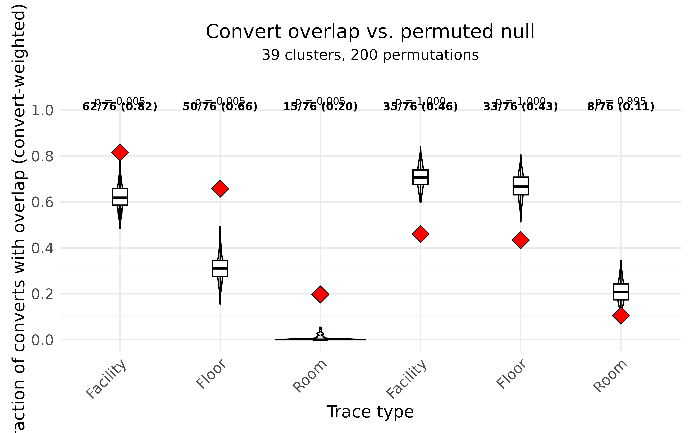

# Epidemiological overlap analysis

A genomic cluster tells us that a group of isolates are closely related,
but on its own it does not say *how* the organism moved between the
patients in that cluster. `hospitraceR` answers that question by
layering the patients’ movements through the facility on top of the
genomic clusters: it asks whether the patients in a cluster were in the
same place at overlapping times, and uses that to categorize the likely
transmission route. This article walks through that workflow, from a
single isolate lookup table to a permutation test of whether the
observed overlap exceeds chance.

We start, as in the [introductory
article](https://theabhirath.github.io/hospitraceR/articles/hospitraceR.md),
by clustering the example isolates with the threshold-free
shared-variant method of Hawken et al. (2022). Visualization is provided
by the companion package
[`hospitraceRVisualize`](https://github.com/theabhirath/hospitraceRVisualize).

``` r

library(hospitraceR)
library(hospitraceRVisualize)
library(ape)
library(ggplot2)

# An example dataset of isolates and their patient epidemiological metadata.
extdata_dir <- file.path("..", "..", "inst", "extdata")
load(file.path(extdata_dir, "example.RData"))
dna_aln <- read.dna(file.path(extdata_dir, "example.fasta"), format = "fasta")

# Keep isolates whose patients appear in the location traces, then the variable sites
dna_aln <- dna_aln[dna_pt_labels[labels(dna_aln)] %in% rownames(facility_trace), ]
dna_var <- dna_aln[, apply(dna_aln, 2, function(x) sum(x == x[1]) < nrow(dna_aln))]

snp_dist <- get_snp_dist_matrix(dna_var)
tree <- get_phylo_tree(dna_var, snp_dist, "pars")
#> Final p-score 2673 after  20 nni operations

clusters <- get_tn_clusters_sv_index(
    dna_var, snp_dist, adm_seqs, adm_pos_pt_seqs, dna_pt_labels, dates, tree
)
```

## The isolate lookup table

Almost every function below consumes the same table: a per-isolate
lookup that joins each isolate’s cluster to its patient, collection
date, admission status, and surveillance history.
[`get_isolate_lookup()`](https://theabhirath.github.io/hospitraceR/reference/get_isolate_lookup.md)
builds it. The two surveillance-derived columns are what make the
epidemiological reasoning possible:

- `prev_surv` is the most recent surveillance date strictly before the
  isolate;
- `prev_surv_neg` is `TRUE` only when the patient had a prior
  surveillance *and none of the surveillances before this isolate were
  positive* — a genuine previous-negative to current-positive
  conversion. This tells us which isolates specifically were detected as
  part of acquisition events.

``` r

isolate_lookup <- get_isolate_lookup(
    clusters, dna_var, dna_pt_labels, adm_seqs, dates, surv_df
)
head(isolate_lookup)
#>   isolate_id patient_id date cluster adm_pos prev_surv prev_surv_neg
#> 1        102        147   41       1    TRUE        41         FALSE
#> 2        105        149   59       2    TRUE        59         FALSE
#> 3        109        259   70       3   FALSE        58          TRUE
#> 4         10        129  117       4   FALSE        56         FALSE
#> 5        112        115   73       5   FALSE        56         FALSE
#> 6        114        193   82       6    TRUE        82         FALSE
```

## Categorizing patients by transmission role

Within each cluster, we attempt to categorize patients based on
different roles: an *index* who carried the organism on admission,
*converts* who acquired it during their stay, *weak indices* whose first
surveillance was already positive, and so on.
[`cluster_patient_categorization()`](https://theabhirath.github.io/hospitraceR/reference/cluster_patient_categorization.md)
assigns each patient in each cluster one of these roles from its
admission status, surveillance cultures, and collection dates.
[`flatten_cluster_patient_categorization()`](https://theabhirath.github.io/hospitraceR/reference/flatten_cluster_patient_categorization.md)
turns the nested result into a tidy data frame, one row per
cluster-patient pair:

``` r

patient_cats <- cluster_patient_categorization(isolate_lookup, surv_df)
patient_cat_df <- flatten_cluster_patient_categorization(patient_cats)

table(patient_cat_df$category)
#> 
#>                  adm-pos          adm-pos-convert                  convert 
#>                       31                        4                       81 
#>                    index multiply-colonized-index        secondary-convert 
#>                       67                       10                       12 
#>               weak-index 
#>                        4
```

The converts are the patients we most want to explain: each one acquired
the organism somewhere, and the location traces are how we look for that
“somewhere”.

## Overlap between isolates

The raw ingredient is the overlap between *pairs* of isolates.
[`isolate_isolate_overlap()`](https://theabhirath.github.io/hospitraceR/reference/isolate_isolate_overlap.md)
takes the lookup and a patient-by-date trace matrix (here
`facility_trace`, marking which facility each patient was in on each
day) and, for every ordered donor-recipient pair, counts the days on
which the two patients were in the same place. The window it searches
runs from the donor’s previous surveillance date up to the recipient’s
collection date — the period during which the donor could plausibly have
transmitted to the recipient before the recipient’s positive isolate was
collected.

``` r

iso_overlap <- isolate_isolate_overlap(isolate_lookup, facility_trace)
head(iso_overlap)
#>   iso_donor iso_recipient overlap_days
#> 1       102           105            0
#> 2       102           109            8
#> 3       102            10            1
#> 4       102           112           24
#> 5       102           114            0
#> 6       102           115           26
```

This is *concurrent* overlap: the two patients were physically
co-located at the same time.
[`isolate_isolate_sequential_overlap()`](https://theabhirath.github.io/hospitraceR/reference/isolate_isolate_sequential_overlap.md)
instead captures *indirect* overlap, where the recipient later occupies
a location the donor had been in earlier — a possible environmental or
intermediary route. Pairs with any concurrent co-location are excluded
from the sequential count, so the two notions do not double-count the
same contact.

## From isolate pairs to cluster explanations

[`cluster_isolate_overlap()`](https://theabhirath.github.io/hospitraceR/reference/cluster_isolate_overlap.md)
collapses the pairwise overlaps to the cluster level: for each isolate
in a multi-patient cluster, does *any* other isolate in the same cluster
overlap with it? Admission-positive isolates are reported as `NA`, since
they were not acquired in the facility and so need no in-facility
explanation.

``` r

cluster_overlap <- cluster_isolate_overlap(isolate_lookup, iso_overlap)
```

[`categorize_cluster_overlap()`](https://theabhirath.github.io/hospitraceR/reference/categorize_cluster_overlap.md)
then labels each cluster by how well its conversions are explained. A
cluster where the index is admission-positive and every convert has an
overlap is `patient-to-patient`; one where a convert is left unexplained
is `missing-intermediate`; and there are further categories for weak
indices, multiply-colonized indices, and clusters that the location data
cannot account for.
[`flatten_cluster_overlap_categorization()`](https://theabhirath.github.io/hospitraceR/reference/flatten_cluster_overlap_categorization.md)
tidies the result:

``` r

overlap_cats <- categorize_cluster_overlap(isolate_lookup, cluster_overlap, surv_df)
overlap_cat_df <- flatten_cluster_overlap_categorization(overlap_cats)

table(overlap_cat_df$category)
#> 
#>                        all-admission-positive 
#>                                             6 
#>                          false-negative-index 
#>                                             2 
#>                                  inexplicable 
#>                                             2 
#>                          missing-intermediate 
#>                                             7 
#>                                missing-source 
#>                                             2 
#>                      multiply-colonized-index 
#>                                             1 
#> multiply-colonized-index-missing-intermediate 
#>                                             1 
#>                            patient-to-patient 
#>                                            17 
#>                 weak-index-patient-to-patient 
#>                                             1
```

Most multi-patient clusters fall into the explained `patient-to-patient`
category, which is the signal we would expect if co-location within the
facility is genuinely driving transmission.

## Convert events with overlap

To summarize a whole clustering with a single number,
[`fraction_convert_events_with_overlap()`](https://theabhirath.github.io/hospitraceR/reference/fraction_convert_events_with_overlap.md)
reduces the cluster-level overlaps to the fraction of *convert events*
(previous-negative patients who then turned positive) that have an
overlap explanation. It returns the per-cluster fractions, but also
carries the per-cluster numerator (`n_overlap`) and denominator
(`n_converts`) as attributes, so that clusters can be pooled by their
number of converts rather than averaged as equal-weight fractions:

``` r

convert_overlap <- fraction_convert_events_with_overlap(cluster_overlap, isolate_lookup)

# convert-weighted pooled fraction across all clusters
sum(attr(convert_overlap, "n_overlap")) / sum(attr(convert_overlap, "n_converts"))
#> [1] 0.8157895
```

## Is the overlap more than chance?

A high fraction is only meaningful if it is higher than we would get by
shuffling patients between clusters at random.
[`cluster_overlap_perm_test()`](https://theabhirath.github.io/hospitraceR/reference/cluster_overlap_perm_test.md)
runs that comparison. It computes the observed pooled overlap fraction
at facility, floor, and room level (and their sequential variants), then
repeatedly permutes the cluster assignments — preserving the
index/convert structure — and recomputes the fraction each time to build
a null distribution.

The expensive isolate-pair overlaps depend only on patient movements,
not on cluster labels, so they are computed once and reused across
permutations. We use a modest number of permutations here to keep the
article quick; a real analysis would use more.

``` r

perm <- cluster_overlap_perm_test(
    clusters, dna_var, dna_pt_labels, adm_seqs, adm_pos_pt_seqs,
    dates, surv_df, facility_trace, floor_trace, room_trace,
    nperm = 200, num_cores = 2
)
```

The test returns the observed and permuted fractions, together with the
numerator/denominator counts behind each. We pool those counts — across
all clusters for this one dataset — into an observed fraction and a null
distribution per trace type. (A real analysis would run the same test
across many sequence types and pool over all of them.)

``` r

trace_types <- c("facility", "floor", "room", "seq_facility", "seq_floor", "seq_room")
nperm <- 200

# observed pooled fraction (and counts) per trace type
obs_df <- do.call(rbind, lapply(trace_types, function(tt) {
    numer <- sum(perm$observed_n_overlap[[tt]], na.rm = TRUE)
    denom <- sum(perm$observed_n_converts[[tt]], na.rm = TRUE)
    data.frame(
        trace_type = tt,
        overlap_fraction = ifelse(denom > 0, numer / denom, NA_real_),
        n_overlap = numer,
        n_converts = denom
    )
}))

# null distribution: pooled fraction per trace type, per permutation
perm_df <- do.call(rbind, lapply(seq_along(trace_types), function(j) {
    fr <- vapply(seq_len(nperm), function(p) {
        numer <- sum(perm$permuted_n_overlap[, j, p], na.rm = TRUE)
        denom <- sum(perm$permuted_n_converts[, j, p], na.rm = TRUE)
        if (denom > 0) numer / denom else NA_real_
    }, numeric(1))
    data.frame(trace_type = trace_types[j], overlap_fraction = fr)
}))

# one-sided p-value: how often the null meets or exceeds the observed fraction
pvals <- vapply(seq_along(trace_types), function(j) {
    null_vals <- perm_df$overlap_fraction[perm_df$trace_type == trace_types[j]]
    (sum(null_vals >= obs_df$overlap_fraction[j], na.rm = TRUE) + 1) / (nperm + 1)
}, numeric(1))

obs_df$p_value <- pvals
obs_df
#>     trace_type overlap_fraction n_overlap n_converts     p_value
#> 1     facility        0.8157895        62         76 0.004975124
#> 2        floor        0.6578947        50         76 0.004975124
#> 3         room        0.1973684        15         76 0.004975124
#> 4 seq_facility        0.4605263        35         76 1.000000000
#> 5    seq_floor        0.4342105        33         76 1.000000000
#> 6     seq_room        0.1052632         8         76 0.995024876
```

[`hospitraceRVisualize::plot_overlap_perm_test()`](https://theabhirath.github.io/hospitraceRVisualize/reference/plot_overlap_perm_test.html)
draws the core figure: a violin of the null distribution for each trace
type, with the observed fraction as a red diamond and the observed
counts labelled above. It expects the trace type to be a factor whose
levels set the x-axis order, shared between the two data frames:

``` r

perm_df$trace_type <- factor(perm_df$trace_type, levels = trace_types)
obs_df$trace_type <- factor(obs_df$trace_type, levels = trace_types)

# annotate each trace type with its permutation p-value
annot <- data.frame(
    trace_type = obs_df$trace_type,
    label = sprintf("p = %.3f", obs_df$p_value),
    y = 1.04
)

plot_overlap_perm_test(
    perm_df, obs_df,
    title = "Convert overlap vs. permuted null",
    subtitle = sprintf("%d clusters, %d permutations", length(perm$valid_clusters), nperm)
) +
    geom_text(data = annot, aes(x = trace_type, y = y, label = label), size = 3, inherit.aes = FALSE)
```



The pattern is clear and biologically sensible. The concurrent
co-location fractions (facility, floor, room) sit well above their null
distributions: converts really were co-located with a plausible donor
far more often than random cluster assignment would produce. The
sequential (indirect) fractions, by contrast, fall within or below their
nulls, so once direct co-location is accounted for, indirect location
sharing adds no signal beyond chance. The facility level shows the
strongest effect, as expected, since being on the same floor or in the
same room implies being in the same facility.

## References

Hawken, Shawn E, Rachel D Yelin, Karen Lolans, et al. 2022.
“Threshold-Free Genomic Cluster Detection to Track Transmission Pathways
in Health-Care Settings: A Genomic Epidemiology Analysis.” *The Lancet
Microbe* 3 (9): e652–62.
<https://doi.org/10.1016/s2666-5247(22)00115-x>.
