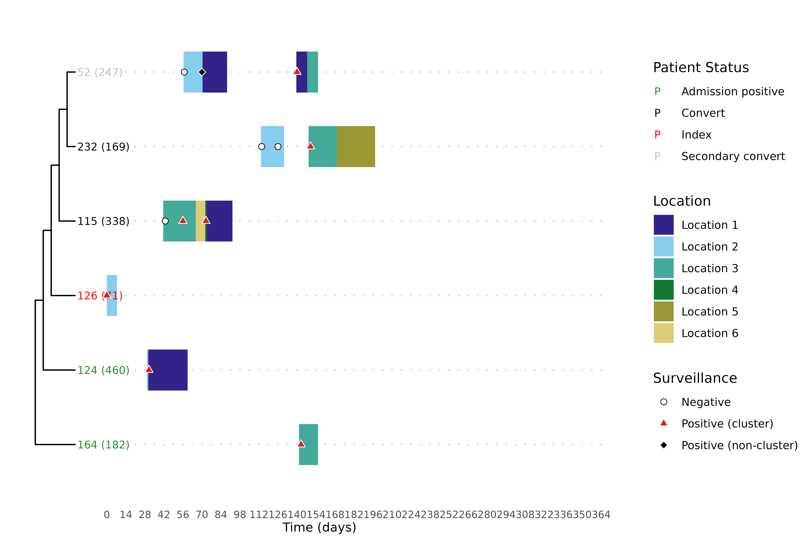

# Visualizing transmission with the trace-phylogeny figure

The clusters and overlap analyses in the other articles are summaries:
they reduce a transmission story to labels and fractions. To actually
*read* a cluster — to see who was where, when each patient first turned
positive, and how the genomes relate — it helps to look at all of that
at once. The trace-phylogeny figure, drawn by
[`hospitraceRVisualize::plot_trace_phylo_tree()`](https://theabhirath.github.io/hospitraceRVisualize/reference/plot_trace_phylo_tree.html),
places the phylogenetic tree of a cluster’s isolates beside each
patient’s movement through the facility, with surveillance cultures
overlaid. It is the headline figure of the toolkit, and this article
shows how to build it.

We reuse the threshold-free clustering from the [introductory
article](https://theabhirath.github.io/hospitraceR/articles/hospitraceR.md),
and the per-isolate lookup and patient categorization from the [overlap
analysis
article](https://theabhirath.github.io/hospitraceR/articles/overlap_analysis.md),
since the figure is driven by both.

``` r

library(hospitraceR)
library(hospitraceRVisualize)
library(ape)

# An example dataset of isolates and their patient epidemiological metadata.
extdata_dir <- file.path("..", "..", "inst", "extdata")
load(file.path(extdata_dir, "example.RData"))
dna_aln <- read.dna(file.path(extdata_dir, "example.fasta"), format = "fasta")

# Keep isolates whose patients appear in the location traces, then the variable sites
dna_aln <- dna_aln[dna_pt_labels[labels(dna_aln)] %in% rownames(facility_trace), ]
dna_var <- dna_aln[, apply(dna_aln, 2, function(x) sum(x == x[1]) < nrow(dna_aln))]

snp_dist <- get_snp_dist_matrix(dna_var)
tree <- get_phylo_tree(dna_var, snp_dist, "pars")
#> Final p-score 2673 after  20 nni operations

clusters <- get_tn_clusters_sv_index(
    dna_var, snp_dist, adm_seqs, adm_pos_pt_seqs, dna_pt_labels, dates, tree
)
```

## Preparing the inputs

[`plot_trace_phylo_tree()`](https://theabhirath.github.io/hospitraceRVisualize/reference/plot_trace_phylo_tree.html)
needs three things from `hospitraceR`: the phylogenetic `tree`, an
isolate lookup from
[`get_isolate_lookup()`](https://theabhirath.github.io/hospitraceR/reference/get_isolate_lookup.md),
and the patient categorization from
[`cluster_patient_categorization()`](https://theabhirath.github.io/hospitraceR/reference/cluster_patient_categorization.md)
(which colors each tip label by the patient’s inferred role). The
remaining inputs — a patient-by-date trace matrix and the surveillance
data frame — come straight from the dataset. We use `floor_trace` here
so that different floors show up as different colors.

``` r

isolate_lookup <- get_isolate_lookup(
    clusters, dna_var, dna_pt_labels, adm_seqs, dates, surv_df
)
patient_cats <- cluster_patient_categorization(isolate_lookup, surv_df)
```

A facility-wide figure with every isolate would be unreadable, so the
figure is drawn one cluster at a time via the `cluster_filter` argument.
To pick an illustrative cluster, we categorize each cluster’s overlap
(see the [overlap analysis
article](https://theabhirath.github.io/hospitraceR/articles/overlap_analysis.md))
and take the largest `patient-to-patient` cluster — one where the
location traces explain every conversion:

``` r

iso_overlap <- isolate_isolate_overlap(isolate_lookup, facility_trace)
cluster_overlap <- cluster_isolate_overlap(isolate_lookup, iso_overlap)
overlap_cats <- categorize_cluster_overlap(isolate_lookup, cluster_overlap, surv_df)

p2p_clusters <- as.numeric(names(overlap_cats)[overlap_cats == "patient-to-patient"])
cluster_sizes <- vapply(
    p2p_clusters,
    function(cl) length(unique(isolate_lookup$patient_id[isolate_lookup$cluster == cl])),
    integer(1)
)
focus_cluster <- p2p_clusters[which.max(cluster_sizes)]
focus_cluster
#> [1] 5
```

## Drawing the figure

With the inputs assembled, the figure is a single call. The tree is
shown on the left, with one representative isolate per patient; the
colored bars are each patient’s location over time; and the dots mark
surveillance cultures (negative, positive within the cluster, positive
elsewhere). Tip labels are colored by the patient’s role from
`patient_cats`.

``` r

plot_trace_phylo_tree(
    tree = tree,
    isolate_lookup = isolate_lookup,
    trace_data = floor_trace,
    surv_df = surv_df,
    cluster_filter = focus_cluster,
    clust_patient_categories = patient_cats
)
```



## References
