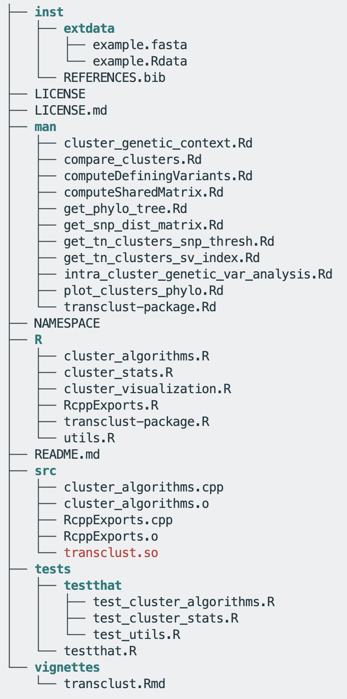
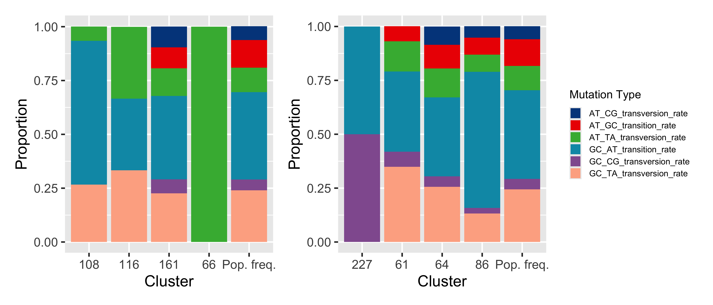

```{r}
#| echo: false
#| message: false
#| warning: false
#| include: false
#| results: hide

devtools::install_github("theabhirath/transclust")
library(transclust)
library(ape)
library(tidyverse)
library(ggalign)
library(paletteer)

load(system.file("extdata", "example.Rdata", package = "transclust"))
dna_aln <- read.dna(system.file("extdata", "example.fasta", package = "transclust"), format = "fasta")
# Get all variable positions in the alignment
var_pos <- apply(dna_aln, 2, function(x) sum(x == x[1]) < nrow(dna_aln))
# Only keep those labels that are in the trace matrix
valid_labels <- dna_pt_labels[labels(dna_aln)] %in% colnames(trace_mat)
dna_var <- dna_aln[valid_labels, var_pos]
```

## Motivation

- Epidemiology is the study of how diseases affect the health and illness of populations.
- Studying the transmission of infectious diseases is crucial for understanding their spread and controlling outbreaks.
- Whole genome sequencing (WGS) is a powerful tool for studying the genetic diversity of pathogens and their transmission dynamics.

## How do we study transmission?

- **Transmission clusters** are groups of individuals who are likely to be linked by a common source of infection or transmission.
- Why are clusters important?
    - They can help identify potential sources of outbreaks.
    - They can inform public health interventions and control measures.
    - They can provide insights into the evolution and spread of pathogens.

## Understanding our data – WGS data {auto-animate="true"}

- WGS data is just FASTA files containing the sequence information of the pathogens.
- These FASTA files are generated with an upstream bioinformatics pipeline that includes QC, alignment, and variant calling.
- **Not important for us at the moment**! All we need to know is that at the end of this we get a FASTA file that contains sequences of the pathogens we are interested in.

## Understanding our data – Epidemiological data {auto-animate="true"}

- Epidemiological data is typically collected through tracing the movements of patients.
- Our data is composed of patients from long-term acute care hospitals (LTACHs) – these are patients who would be in the facility for a long time.
- We have admission dates, mappings from patients to microbial isolates, and also patient "traces" of which floors the patients were on during their stay.

## What results do we want from our data?

- Clusters of patients that are likely linked by a common source of infection or transmission.
- We want to be able to visualize these clusters in a way that is easy to understand and interpret.
- We also want to be able to perform some simple statistical analyses on these clusters, such as analyzing specific mutational signatures that may emerge in each of these clusters.

## How is the code structured? {.smaller}

:::: {.columns}

::: {.column width="70%"}
- Three modules - algorithms, visualization, and statistical analysis.
- The algorithms module also has a helper Rcpp module that is used for a performance boost.
    - How much faster? Benchmarks showed a more than <span style="color:red;">10x</span> speedup for the shared-variant algorithm – waiting times went from over 12 minutes to under 1 minute!
- Helper functions are also included in a `utils.R` file that can be utilized by the end-user for easy integration into a high-level workflow.
- The package folder structure is shown alongside and is similar to a typical R package structure, as detailed in the R package development book^[https://r-pkg-development.r-lib.org/].
:::

::: {.column width="30%" .fragment}
{.lightbox}
:::

::::

## How do we identify clusters?

- One of the most common methods for designating two isolates as part of the same transmission cluster is to use a **genomic distance threshold**.
- This threshold is often based on the number of single nucleotide polymorphisms (SNPs) between two genomes.
- ::: {.fragment .highlight-red}
    **Limitations**: this is very sensitive to the choice of threshold, and does not generalize well enough!
:::

## SNP-threshold clustering {.center}

```{r}
#| echo: true
#| code-line-numbers: "1-2|4-5|7-9|11-12|14-15"
#| output-location: slide

# Get the SNP distance matrix
snp_dist <- get_snp_dist_matrix(dna_var)

# Perform hierarchical clustering based on SNP distance matrix
snp_hclust <- hclust(as.dist(snp_dist))

# Convert hierarchical clustering into a phylogenetic tree using 
# the complete linkage method
phylo_tree <- as.phylo(snp_hclust)

# Identify transmission clusters using a SNP threshold
clusters_snp <- get_tn_clusters_snp_thresh(snp_hclust, phylo_tree, 10)

# Plot the clusters on the phylogenetic tree
plot_clusters_phylo(clusters_snp, phylo_tree)
```

## How do we overcome the limitations?

- SNP clusters are not always the best way to identify transmission clusters.
- One way in which large SNP distances can exist between two transmission isolates is if variation arises in a patient during a prolonged asymptomatic infection.
- This is especially true for patients in LTACHs, where patients can be in the facility for months.
- ::: {.fragment .highlight-red}
We need a different algorithm that can take into account the **epidemiological data** we have as well.
:::

## Shared-variant based algorithm {.smaller}

- Based on the work of Hawken et al. (2022), we can use a shared-variant based algorithm to identify transmission clusters.
- This is a SNP threshold-free algorithm – we do not have to worry about the choice of threshold!

. . .

```{r}
#| echo: true
#| message: false
#| warning: false
#| results: hide

# Create a parsimony tree
phylo_tree_pars <- get_phylo_tree(dna_var, snp_dist, "pars")

# Use the shared-variant based algorithm to identify transmission clusters
clusters_sv <- get_tn_clusters_sv_index(
    dna_var, snp_dist, ip_seqs_3days, ip_seqs,
    dna_pt_labels, dates, phylo_tree_pars
)
```

- This algorithm uses an Rcpp helper function to speed up the process of identifying clusters.
- It uses both genomic data and patient admissions data to identify clusters.

::: footer
Hawken, S. E. et al. Threshold-free genomic cluster detection to track transmission pathways in health-care settings: a genomic epidemiology analysis. <br> The Lancet Microbe 3, e652–e662 (2022).
:::

## Compare the two clustering methods

```{r}
#| echo: true
#| code-line-numbers: "|1"
#| code-fold: true

compare_clusters(clusters_snp, clusters_sv) +
    # change the color palette
    scale_fill_paletteer_c("grDevices::Mint", direction = -1) +
    # add a title
    ggtitle("Comparison of clusters using SNP threshold and threshold-free methods") +
    # add x and y axis labels
    xlab("Threshold-free clusters") +
    ylab("SNP threshold clusters") +
    # center the title and rotate x axis labels
    theme(
        plot.title = element_text(hjust = 0.5),
        axis.text.x = element_text(angle = 45, hjust = 1)
    )
```

## Statistical analysis of clusters

. . .

We want to look at the proportion of different mutation types in each cluster to see if there are any patterns that emerge.

. . .

```{r}
mut_var_df <- intra_cluster_genetic_var_analysis(clusters_sv, dna_aln, var_pos)
mut_var_df <- head(na.omit(mut_var_df)[, -1])
# Add column for cluster using rownames before pivoting
mut_var_df$cluster <- row.names(mut_var_df)

# Convert the data frame to long format for ggplot
mut_var_df_long <- pivot_longer(
    mut_var_df,
    cols = -cluster,
    names_to = "mutation_type",
    values_to = "proportion"
)

# Create the stacked bar plot
ggplot(mut_var_df_long, aes(x = cluster, y = proportion, fill = mutation_type)) +
    geom_bar(stat = "identity") +
    labs(x = "Cluster", y = "Proportion", fill = "Mutation Type") +
    scale_fill_paletteer_d("ggsci::lanonc_lancet")
```

## Extending the dataset

. . .

We can extend the same package to include more sequences and patients.



## Conclusions

- `transclust` is a package that can be used to identify transmission clusters using genomic and epidemiological data.
- It provides methods for identifying clusters, and also for visualizing and analyzing these clusters.
- The package is easy to use, is performant, and can be extended to include more sequences and patients.

## Not-so-future work

. . .

:::: {.columns}

::: {.column width="80%"}
{.lightbox}
:::

::: {.column width="20%"}
::: {style="font-size:50%; color: gray;"}
Visualizing patient traces alongside a phylogenetic tree
:::
:::

::::

## Future directions

- Explore additional algorithms for cluster detection.
    - How do we incorporate epidemiological data more effectively?
- Investigate the integration of more diverse datasets.
    - Does the algorithm work well with other pathogens? Other "types" of transmission, such as those not restricted to a single facility?
- Come up with more rigorous statistical tests for the clusters.
    - How do we validate the clusters we find are actually significant?

## Thank you! {.center}

Questions?
